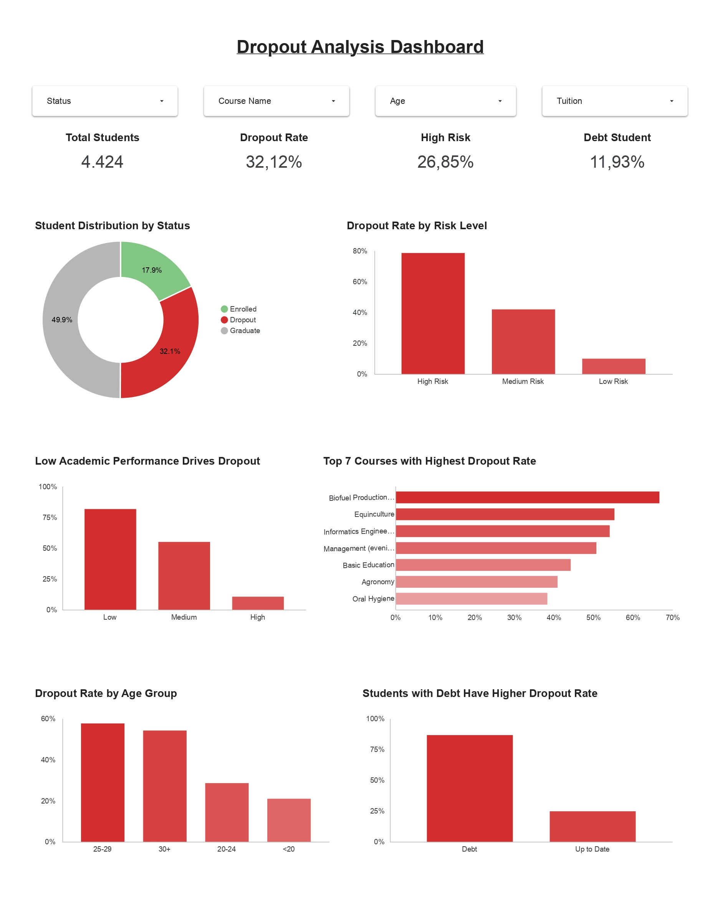

# Proyek Akhir: Menyelesaikan Permasalahan Jaya Jaya Institute

## Business Understanding
Jaya Jaya Institut merupakan institusi pendidikan tinggi yang telah berdiri sejak tahun 2000 dan memiliki reputasi yang baik dalam menghasilkan lulusan berkualitas. Namun demikian, institusi ini menghadapi permasalahan serius berupa tingginya jumlah mahasiswa yang tidak menyelesaikan studi (dropout). Tingginya angka dropout tidak hanya berdampak pada reputasi institusi, tetapi juga berpengaruh terhadap efisiensi operasional, tingkat kelulusan, serta kepuasan mahasiswa. Oleh karena itu, diperlukan suatu pendekatan berbasis data untuk mendeteksi sejak dini mahasiswa yang berpotensi mengalami dropout agar dapat diberikan intervensi yang tepat.

### Permasalahan Bisnis
Permasalahan utama yang dihadapi adalah:

* Tingginya tingkat dropout mahasiswa
* Tidak adanya sistem deteksi dini untuk mengidentifikasi mahasiswa berisiko
* Keterbatasan dalam memahami faktor-faktor yang mempengaruhi dropout
* Kurangnya alat monitoring performa mahasiswa secara menyeluruh

### Cakupan Proyek
Proyek ini berfokus pada pengembangan sistem berbasis data untuk mendeteksi risiko dropout mahasiswa di Jaya Jaya Institut. Cakupan proyek meliputi:

* Melakukan eksplorasi dan pemahaman data (data understanding)
* Melakukan data preprocessing dan feature engineering
* Mengembangkan model machine learning untuk klasifikasi status mahasiswa (Dropout vs Graduate)
* Mengevaluasi performa model menggunakan metrik yang relevan
* Membangun dashboard interaktif untuk analisis dan monitoring
* Mengembangkan prototype sistem prediksi berbasis web menggunakan Streamlit

### Persiapan

Sumber data: [Lihat Dataset](https://raw.githubusercontent.com/dicodingacademy/dicoding_dataset/refs/heads/main/students_performance/data.csv)

Setup environment:

- Buat Virtual environment
```
python3 -m venv env
```
- Jalankan virtual environment
```
source venv/bin/activate   # Mac/Linux
venv\Scripts\activate      # Windows
```
- Install library yang dipakai
```
pip install -r requirements.txt
```

## Business Dashboard
Dashboard yang dikembangkan bertujuan untuk membantu Jaya Jaya Institut dalam memonitor performa mahasiswa serta mengidentifikasi faktor-faktor yang berkontribusi terhadap tingginya angka dropout secara visual dan interaktif. Dashboard ini menyajikan berbagai metrik utama dan visualisasi penting yang memudahkan stakeholder dalam memahami kondisi mahasiswa secara menyeluruh.

Dashboard ini membantu institusi dalam:

* Mengidentifikasi faktor utama penyebab dropout
* Memantau performa mahasiswa secara real-time
* Menentukan prioritas intervensi
* Mendukung pengambilan keputusan berbasis data

Dashboard dapat diakses [disini](https://lookerstudio.google.com/reporting/9b124977-25e2-4a24-a0cd-264aa5d9e87c)



## Menjalankan Sistem Machine Learning
Jelaskan cara menjalankan protoype sistem machine learning yang telah dibuat. Selain itu, sertakan juga link untuk mengakses prototype tersebut.
Prototype sistem machine learning dikembangkan menggunakan Streamlit untuk memungkinkan pengguna melakukan prediksi risiko dropout mahasiswa secara interaktif.

Sistem ini menerima input data mahasiswa yang meliputi:

* Data demografis (umur, nilai sebelumnya, program studi)
* Performa akademik semester 1 dan 2
* Kondisi finansial (status pembayaran biaya kuliah)

Setelah input dimasukkan, sistem akan:

* Melakukan feature engineering (perhitungan rasio performa akademik)
* Melakukan preprocessing (scaling)
* Menggunakan model machine learning (XGBoost) untuk memprediksi probabilitas dropout
* Menampilkan hasil prediksi dalam bentuk kategori risiko (Low, Medium, High) beserta visualisasi


Untuk menjalankan sistem machine learning prediksi dropout mahasiswa ada 2 cara, bisa dilakukan secara online ataupun lokal.

**Menjalankan Prototype Secara Lokal**

1. Clone repository:
```
git clone https://github.com/ahmadaldiyanto/dropout-app.git
cd dropout-app
```
2. Aktifkan virtual environment:
```
source venv/bin/activate   # Mac/Linux
venv\Scripts\activate      # Windows
```
3. Install dependencies:
```
pip install -r requirements.txt
```
4. Jalankan aplikasi:
```
streamlit run app.py
```
5. Buka di browser:
```
http://localhost:8501
```

**Menjalankan Prototype Secara Online**

Untuk menjalankan prototype secara online, link bisa di akses di [sini](https://dropout-app-jaya-institute.streamlit.app/)
```
https://dropout-app-jaya-institute.streamlit.app/
```

## Conclusion
Berdasarkan hasil analisis dan pengembangan model machine learning, dapat disimpulkan bahwa:

* Tingkat dropout mahasiswa di Jaya Jaya Institut dipengaruhi secara signifikan oleh performa akademik awal dan kondisi finansial mahasiswa.

* Seluruh model yang diuji (Logistic Regression, Random Forest, XGBoost, dan LightGBM) menunjukkan performa yang baik dengan akurasi di atas 0.91, yang mengindikasikan bahwa fitur yang digunakan mampu merepresentasikan karakteristik mahasiswa secara efektif.

* Dalam konteks penelitian ini, fokus utama adalah mendeteksi mahasiswa yang berpotensi dropout, sehingga metrik recall menjadi prioritas. Seluruh model menunjukkan kemampuan yang baik dalam mendeteksi dropout dengan nilai recall yang tinggi.

* Model XGBoost menunjukkan performa terbaik secara keseluruhan dengan akurasi sekitar 0.93 serta recall dropout sebesar 0.93, sehingga mampu mengidentifikasi sebagian besar mahasiswa berisiko dengan baik.

* Berdasarkan analisis feature importance, fitur yang paling berpengaruh dalam memprediksi dropout adalah:
    - Rasio performa akademik (ratio_1 dan ratio_2)
    - Jumlah mata kuliah yang lulus (approved units)
    - Nilai akademik semester awal
    - Status pembayaran biaya kuliah
    - Hal ini menunjukkan bahwa performa akademik di semester awal menjadi indikator utama risiko dropout.

* Dari hasil eksplorasi data dan dashboard, ditemukan beberapa faktor utama penyebab dropout, yaitu:
    - Performa akademik yang rendah pada semester 1 dan 2
    - Jumlah mata kuliah yang tidak lulus cukup tinggi
    - Keterlambatan atau masalah dalam pembayaran biaya kuliah
    - Faktor usia, di mana mahasiswa dengan usia lebih tinggi cenderung memiliki risiko dropout lebih besar

* Karakteristik umum mahasiswa yang cenderung mengalami dropout antara lain:
    - Memiliki nilai akademik rendah sejak semester awal
    - Memiliki rasio kelulusan mata kuliah yang rendah
    - Tidak menyelesaikan pembayaran biaya kuliah tepat waktu
    - Berasal dari kelompok usia non-tradisional (lebih tua)
    - Berada pada program studi dengan tingkat dropout tinggi

* Model yang dikembangkan dapat digunakan sebagai sistem early warning untuk mendeteksi mahasiswa berisiko sejak dini, sehingga institusi dapat melakukan intervensi yang lebih cepat dan tepat.

* Implementasi dalam bentuk dashboard dan aplikasi Streamlit memungkinkan penggunaan yang praktis oleh pihak non-teknis serta mendukung pengambilan keputusan berbasis data.

Secara keseluruhan, proyek ini berhasil mengubah data menjadi insight yang actionable serta menyediakan solusi berbasis teknologi untuk membantu institusi dalam menekan angka dropout.

### Rekomendasi Action Items
* Mengimplementasikan sistem prediksi ini sebagai early warning system untuk mendeteksi mahasiswa berisiko sejak semester pertama.
* Memberikan bimbingan akademik kepada mahasiswa dengan performa rendah
* Menyediakan dukungan finansial atau skema pembayaran fleksibel untuk mahasiswa dengan kendala ekonomi
* Melakukan monitoring rutin menggunakan dashboard
* Mengevaluasi program studi dengan tingkat dropout tinggi
* Meningkatkan keterlibatan dosen pembimbing dalam memantau perkembangan mahasiswa
* Mengintegrasikan model ke dalam sistem akademik institusi
